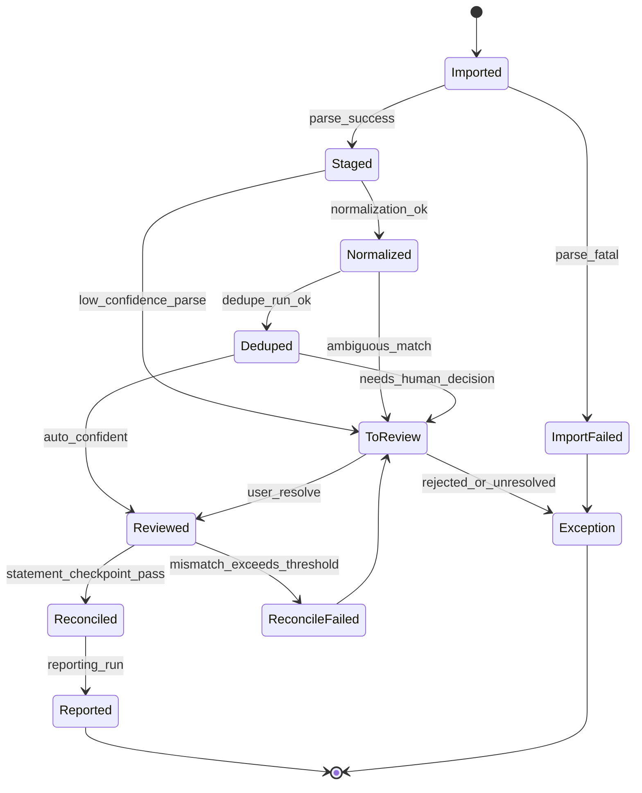
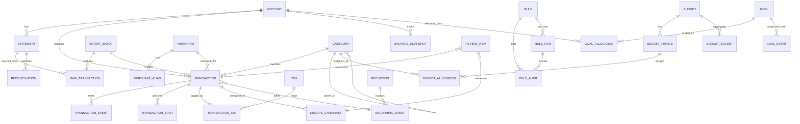

# PRD - Modular Personal Finance OS (Skills-Based)

## 1) Overview
### Problem statement
Build a modular, reusable Personal Finance OS as Python skills for agent harnesses (Codex/Claude Code/OpenCode style), not a consumer SaaS app. The system must ingest mostly PDF statements plus CSV exports, produce a trustworthy canonical ledger, and support deterministic automation (rules, dedupe, reconciliation, budgets, goals, reporting) with human review checkpoints.

Research anchor: the report identifies reusable primitives as ingestion/normalization, entity resolution, rules, dedupe/reconciliation, recurring, goals, and portability ("Executive summary" and "Prioritized reusable skill capabilities").

### Target users / archetypes
- Hands-on budgeter (plan-first): wants zero-based control, strict reconciliation, explicit funding decisions.
- Passive tracker (track-first): wants low-friction imports, review queue, and actionable summaries.
- Household operator: needs shared taxonomy/rules, multi-account controls, and traceable decisions.
- Analyst/power user: wants deterministic runs, exportability, and auditable transformations.
- Agent-builder/developer: wants stable interfaces, schema versioning, and composable skills.

### Goals (what success looks like)
- Reliable local-first ledger from PDFs/CSVs/manual entries with >=95% reconciliation pass rate on clean statement windows.
- Deterministic, explainable automation: same input + config -> same outputs + audit trail.
- Human-in-the-loop review queues for ambiguity (parsing, dedupe, categorization, reconciliation exceptions).
- Two budgeting modes (zero-based and flex) plus goals and recurring overlays.
- Full data portability via export bundle (CSV/JSON + metadata + backups).

### Non-goals
- No live bank aggregation MVP.
- No fancy consumer UI required. Just pure markdown.
- No dependency on opaque, non-auditable automation that bypasses review.
- No hard requirement for cloud services; CLI/TUI is sufficient for operator workflows.
- No brittle PDF-only table parser dependency as the sole extraction path.

## 2) Product principles
- Methodology-aware: plan-first and track-first are first-class modes, not hidden settings.
  - Research anchor: "Budgeting models as interaction contracts" distinguishes YNAB-style zero-based vs automation-heavy tracking.
- Human-in-the-loop and trust.
  - Every low-confidence operation emits review items and diagnostics before ledger finalization.
- Determinism, reproducibility, explainability.
  - Ordered rules, explicit confidence thresholds, immutable import captures, and rerunnable pipelines.
- Local-first posture and portability.
  - SQLite as system-of-record, encrypted-at-rest option, and complete export/import round-trip.
- Subagent delegation for PDFs.
  - Orchestrator agent owns workflow/state transitions.
  - PDF specialist subagent owns extraction heuristics, confidence scoring, diagnostics, and iterative refinement.

## 3) Core concepts & definitions
### Canonical financial primitives/entities
- Account: financial container (checking, credit card, savings, cash, loan).
- Transaction: atomic ledger movement, includes posted/pending status and provenance.
- Merchant: canonical counterparty identity with aliases.
- Category: hierarchical taxonomy for budgeting/reporting.
- Budget: period-scoped plan (zero-based or flex model).
- Goal: virtual savings target with allocations/projections.
- Rule: deterministic matcher+action automation.
- Recurring: inferred or configured schedule for expected transactions.
- Balance Snapshot: account balance checkpoint at timestamp/date.
- Reconciliation: process comparing ledger-derived balances to statement/source balances.
- Tag: orthogonal label dimension.
- Split: transaction decomposition across categories/tags/goals.
- Transfer: linked pair of internal movements between owned accounts.
- Statement: source document (PDF/CSV) with issuer period and ending balances.
- ImportBatch: idempotent ingest envelope with source fingerprint and parse diagnostics.
- ReviewItem: queued human decision for ambiguous or low-confidence cases.

### Definitions for tricky concepts
- Transfers vs expenses:
  - Transfer: value move between owned accounts; excluded from spending by default.
  - Expense: value leaves owned system to external counterparty.
- Credit cards:
  - Float: purchases financed until payment date.
  - Statement balance: cycle-closing liability checkpoint.
  - Payment transaction: transfer from cash account to card liability account.
- Pending vs posted:
  - Pending is provisional, may mutate merchant/date descriptors.
  - Posted is final and eligible for strict rule application/reconciliation.
- Reimbursements:
  - Treated as offsetting inflows tied to original expense category/tag when possible.
- Refunds/chargebacks:
  - Inflows linked to prior outflows; preserve explicit refund relation when matched.
- Split transactions:
  - Single source row allocates amount across multiple categories/goals with invariant sum.
- Rollovers:
  - Policy-driven carryover by category/bucket; can carry positive, negative, or both.
- Multi-account budgeting:
  - Budget scope can include selected asset accounts while excluding tracking accounts.
- Multi-currency (MVP):
  - Detect + warn + preserve original currency/amount fields.
  - Convert only when explicit FX table exists for date/rate source.

## 4) User journeys (end-to-end)
### Journey A: Import PDF statement -> extract rows -> normalize -> dedupe -> review -> reconcile -> report
- Skills/modules invoked:
  - `pdf_statement_classify` -> identify issuer/template/period cues.
  - `pdf_statement_extract` (delegates to PDF subagent) -> extract transactions/balances + diagnostics.
  - `txn_ingest` -> create `import_batches`, raw rows, staged records.
  - `txn_normalize` + `merchant_resolve` -> canonical fields and merchant mapping.
  - `txn_dedupe_match` -> duplicate and pending->posted matching.
  - `review_queue_manage` -> unresolved parse/dedupe/category exceptions.
  - `account_reconcile` -> statement checkpoint matching and adjustments.
  - `reporting_generate` -> cashflow/category/balance deltas.
- SQLite artifacts written:
  - `statements`, `statement_pages`, `import_batches`, `raw_transactions`, `transactions`, `transaction_events`, `merchant_aliases`, `dedupe_candidates`, `review_items`, `reconciliations`, `reports`.

### Journey B: Budgeting: zero-based allocation + targets/sinking funds
- Skills/modules invoked:
  - `budget_compute_zero_based` -> compute To Assign, funded/underfunded/overspent states.
  - `rules_apply` + `categorize_suggest` -> improve categorization quality before budget close.
  - `recurring_detect_and_schedule` -> expected obligations feed target prompts.
- SQLite artifacts written:
  - `budgets`, `budget_periods`, `budget_categories`, `budget_targets`, `budget_allocations`, `budget_rollovers`, `review_items`.

### Journey C: Flex budgeting + rollovers
- Skills/modules invoked:
  - `budget_compute_flex` -> Fixed/Non-monthly/Flex bucket computation independent of category sums.
  - `rules_apply` and `txn_normalize` for bucket attribution.
- SQLite artifacts written:
  - `budgets`, `budget_buckets`, `budget_bucket_actuals`, `budget_rollovers`, `reports`.

### Journey D: Goals as virtual buckets + allocations + projections
- Skills/modules invoked:
  - `goal_ledger` -> allocations, progress, projected completion.
  - `account_reconcile` -> validate that real balances support allocated goal funds.
  - `reporting_generate` -> goal progress and funding gap outputs.
- SQLite artifacts written:
  - `goals`, `goal_allocations`, `goal_events`, `goal_projections`, `review_items`, `reports`.

## 5) Functional requirements (numbered FR-001…)
- FR-001 Ingestion orchestration: system SHALL support ingest from PDF statements, CSV files, and manual entry through a common `ImportBatch` abstraction.
- FR-002 PDF parsing delegation: main agent SHALL delegate all PDF analysis to a specialist subagent and consume only structured outputs + diagnostics.
- FR-003 Layered PDF extraction: PDF subagent SHALL execute strategy tiers in order:
  1) text extraction + heuristic line/item parsing,
  2) optional table extraction,
  3) OCR fallback only when confidence below threshold.
- FR-004 Non-tabular PDFs: parser SHALL support statement layouts without strict tables via section detection + line heuristics (date/description/amount patterns).
- FR-005 PDF diagnostics: each extraction SHALL emit confidence scores, failure codes, page-level notes, and field-level provenance.
- FR-006 CSV ingest: system SHALL ingest configurable CSV schemas (Venmo/PayPal/bank exports) with mapping profiles and validation errors by row.
- FR-007 Manual entry: system SHALL support direct transaction creation/edit with provenance `source=manual`.
- FR-008 Idempotent re-import: system SHALL fingerprint source documents/files and prevent duplicate writes unless explicitly forced with conflict mode.
- FR-009 ImportBatch lifecycle: each batch SHALL persist statuses (`received`, `parsed`, `staged`, `normalized`, `deduped`, `reviewed`, `finalized`, `failed`).
- FR-010 Date/time normalization: system SHALL normalize dates/timezones deterministically and preserve source raw fields.
- FR-011 Sign normalization: system SHALL convert source conventions into canonical sign semantics while preserving original amount/sign fields.
- FR-012 Merchant canonicalization: system SHALL maintain alias->canonical merchant mappings and confidence history.
- FR-013 Category taxonomy: system SHALL support hierarchical categories and user-custom taxonomy overrides.
- FR-014 Tags and splits: system SHALL support multi-tagging and split transactions with sum invariants.
- FR-015 Rules engine core: system SHALL support ordered matchers/actions with deterministic execution and per-change audit logs.
- FR-016 Rules preview: system SHALL support dry-run previews before rule creation/update and before retroactive apply.
- FR-017 Retroactive apply: system SHALL support backfilling rule actions across historical periods with change diff outputs.
- FR-018 Review queue: system SHALL maintain `To Review` states for low-confidence parse/categorize/dedupe/reconcile outputs with bulk actions.
- FR-019 Confidence policy: system SHALL permit configurable thresholds by operation type and route below-threshold results to review.
- FR-020 Dedupe hard matching: system SHALL implement deterministic hard-key matching (`account`, `amount`, date window, normalized merchant/payee).
- FR-021 Pending->posted matching: system SHALL support explicit pending->posted linkage windows with conservative auto-match policy.
- FR-022 Multi-source duplicate safeguards: system SHALL avoid destructive auto-dedupe when conflicting records originate from different sources/providers.
- FR-023 Fuzzy matching constraints: system SHALL provide conservative fuzzy merchant matching with explainable scores and user confirmation gates.
- FR-024 Reconciliation checkpoints: system SHALL reconcile ledger balances against statement ending balances and record adjustment events when approved.
- FR-025 Reconciliation trust score: system SHALL compute account/period trust metrics from match rate, unresolved items, and adjustment magnitude.
- FR-026 Zero-based budgeting engine: system SHALL compute `to_assign`, overspent/underfunded, and target states (`top-up`, `snooze`, scheduled targets).
- FR-027 Flex budgeting engine: system SHALL compute bucket-level controls (Fixed/Non-monthly/Flex) independent from category-sum requirements.
- FR-028 Rollovers semantics: system SHALL support per-category/per-bucket rollover policies with positive/negative carry behavior.
- FR-029 Recurring detection: system SHALL infer recurring patterns (weekly, biweekly, monthly, non-monthly) and generate expected events.
- FR-030 Missed recurring warnings: system SHALL flag expected recurring events not observed within tolerance windows.
- FR-031 Goals engine: system SHALL support save-up goals, allocations, projections, and configurable "spending reduces progress" behavior.
- FR-032 Reporting suite: system SHALL generate cash flow, category trends, net worth, budget-vs-actual, and goal progress views.
- FR-033 Export bundle: system SHALL output canonical CSV/JSON + run metadata + schema version + rule snapshots + diagnostics.
- FR-034 Reproducible runs: system SHALL support deterministic reruns from immutable raw captures and pinned config versions.
- FR-035 Backup/restore: system SHALL provide local backup and restore workflows for complete migration.

## 6) Non-functional requirements (numbered NFR-001…)
- NFR-001 Privacy posture: all core workflows SHALL run locally by default.
- NFR-002 DB encryption option: system SHALL support SQLite encryption option (e.g., SQLCipher) with secure key handling.
- NFR-003 Secret handling: external credentials (if any future connectors) SHALL be stored outside SQLite via OS keychain/env-secret adapters.
- NFR-004 Redaction: logs and diagnostics SHALL support PII/memo redaction policies.
- NFR-005 Auditability: all transformations SHALL write append-only audit entries with actor, timestamp, and reason.
- NFR-006 Determinism: same inputs + schema + rules + config versions SHALL produce identical outputs.
- NFR-007 Schema versioning: every run SHALL record DB schema version and skill interface versions.
- NFR-008 Explainability: every derived field SHALL expose provenance (`rule`, `heuristic`, `manual`, `model_suggestion`).
- NFR-009 Performance baseline: ingest+normalize+dedupe 100k transactions in <10 minutes on a modern laptop (single-user mode).
- NFR-010 Large PDF resilience: parser SHALL handle 300+ page statement batches with incremental page processing.
- NFR-011 Extensibility: architecture SHALL expose connector interfaces (unused in MVP) without changing core ledger logic.
- NFR-012 Taxonomy customization: category and tag taxonomies SHALL be user-extensible without migration breakage.
- NFR-013 Plugin skills: system SHALL support optional skills registered via manifest and semantic version constraints.
- NFR-014 Testability: golden fixtures SHALL exist for PDF->ledger conversions by template.
- NFR-015 Property tests: dedupe/matching SHALL include property-based tests (idempotence, no false merge invariants).
- NFR-016 Migration safety: schema migrations SHALL be forward/backward tested on fixture databases.

## 7) Data model & interfaces
### Canonical SQLite schema (tables + key fields + indexes)
- `accounts(id, name, type, currency, institution, opened_at, closed_at, metadata_json)`
  - indexes: `(type)`, `(currency)`
- `statements(id, account_id, source_type, source_fingerprint, period_start, period_end, ending_balance, currency, status, diagnostics_json, created_at)`
  - unique: `(source_fingerprint)`
  - indexes: `(account_id, period_end)`
- `import_batches(id, source_type, source_ref, source_fingerprint, schema_version, status, received_at, finalized_at, error_summary)`
  - unique: `(source_fingerprint, source_type)`
- `raw_transactions(id, import_batch_id, raw_payload_json, page_no, row_no, extraction_confidence, parse_status, error_code)`
  - indexes: `(import_batch_id)`, `(parse_status)`
- `transactions(id, account_id, posted_date, effective_date, amount, currency, original_amount, original_currency, pending_status, original_statement, merchant_id, category_id, excluded, notes, source_kind, source_transaction_id, import_batch_id, transfer_group_id, created_at, updated_at)`
  - unique partial: `(account_id, source_kind, source_transaction_id)` where `source_transaction_id IS NOT NULL`
  - indexes: `(account_id, posted_date)`, `(merchant_id)`, `(category_id)`, `(pending_status)`
- `transaction_events(id, transaction_id, event_type, old_value_json, new_value_json, reason, actor, provenance, created_at)`
  - indexes: `(transaction_id, created_at)`, `(event_type)`
- `merchants(id, canonical_name, confidence, created_at)`
  - unique: `(canonical_name)`
- `merchant_aliases(id, merchant_id, alias, source_context, confidence, created_at)`
  - unique: `(alias, source_context)`
- `categories(id, parent_id, name, system_flag, active, created_at)`
  - unique: `(parent_id, name)`
- `tags(id, name, created_at)`
  - unique: `(name)`
- `transaction_tags(transaction_id, tag_id)`
  - unique: `(transaction_id, tag_id)`
- `transaction_splits(id, transaction_id, line_no, category_id, amount, memo, goal_id)`
  - indexes: `(transaction_id)`
- `rules(id, name, priority, enabled, apply_to_pending, matcher_json, action_json, created_at, updated_at)`
  - indexes: `(enabled, priority)`
- `rule_runs(id, rule_id, run_mode, dry_run, started_at, completed_at, summary_json)`
- `rule_audits(id, rule_run_id, transaction_id, matched, changes_json, confidence)`
  - indexes: `(transaction_id)`, `(rule_run_id)`
- `dedupe_candidates(id, txn_a_id, txn_b_id, score, decision, reason_json, created_at, decided_at)`
  - indexes: `(decision)`, `(score)`
- `review_items(id, item_type, ref_table, ref_id, reason_code, confidence, status, assigned_to, payload_json, created_at, resolved_at)`
  - indexes: `(status, item_type)`, `(confidence)`
- `balance_snapshots(id, account_id, snapshot_date, balance, source, statement_id, created_at)`
  - unique: `(account_id, snapshot_date, source)`
- `reconciliations(id, account_id, period_start, period_end, expected_balance, computed_balance, delta, match_rate, trust_score, status, created_at)`
  - indexes: `(account_id, period_end)`, `(status)`
- `budgets(id, name, method, base_currency, active, created_at)`
- `budget_periods(id, budget_id, period_month, to_assign, assigned_total, spent_total, rollover_total, status)`
  - unique: `(budget_id, period_month)`
- `budget_categories(id, budget_id, category_id, policy_json)`
- `budget_targets(id, budget_category_id, target_type, amount, cadence, top_up, snoozed_until, metadata_json)`
- `budget_allocations(id, budget_period_id, budget_category_id, assigned_amount, source)`
- `budget_buckets(id, budget_id, period_month, bucket_name, planned_amount, actual_amount, rollover_policy)`
- `budget_rollovers(id, budget_id, dimension_type, dimension_id, from_period, to_period, carry_amount, policy_applied)`
- `recurrings(id, merchant_id, category_id, schedule_type, interval_n, anchor_date, tolerance_days, active, metadata_json)`
- `recurring_events(id, recurring_id, expected_date, observed_transaction_id, status)`
- `goals(id, name, target_amount, target_date, monthly_contribution, spending_reduces_progress, status, metadata_json)`
- `goal_allocations(id, goal_id, account_id, period_month, amount, allocation_type, created_at)`
- `goal_events(id, goal_id, event_date, event_type, amount, related_transaction_id, metadata_json)`
- `reports(id, report_type, period_start, period_end, generated_at, payload_json, run_id)`
- `run_metadata(id, pipeline_name, code_version, schema_version, config_hash, started_at, completed_at, status, diagnostics_json)`

### Event model: immutable ledger events vs derived views/materialized summaries
- Immutable layer:
  - `raw_transactions`, `transaction_events`, `rule_audits`, `dedupe_candidates`, `reconciliations`, `run_metadata`.
- Mutable canonical layer:
  - `transactions` current state with provenance pointers.
- Derived views/materializations:
  - monthly/category rollups, net worth timeline, budget-vs-actual, goal progress, recurring health.
- Rule: no destructive delete for financial facts; use tombstone/event semantics.

### Interfaces between skills (inputs/outputs, versioning, error modes)
- Interface contract:
  - input/output JSON schemas versioned with `major.minor.patch`.
  - each skill returns `result`, `diagnostics`, `provenance`, `errors`, `warnings`, `metrics`.
- Error modes:
  - `fatal` (pipeline stop), `recoverable` (review queue), `informational` (warning only).
- Version pinning:
  - orchestrator records skill version hashes per run in `run_metadata`.

### Import/export formats (CSV columns, JSON schemas)
- Canonical CSV columns:
  - `transaction_id,account_id,posted_date,effective_date,amount,currency,original_amount,original_currency,pending_status,merchant,original_statement,category,parent_category,tags,excluded,notes,source_kind,source_transaction_id,import_batch_id,created_at,updated_at`.
- Canonical JSON bundle:
  - `manifest.json` (schema version, generated_at, checksums)
  - `accounts.json`, `transactions.jsonl`, `rules.json`, `budgets.json`, `goals.json`, `reconciliations.json`, `review_items.json`, `diagnostics.json`.

### Migration strategy for schema evolution
- Recommended stack:
  - SQLAlchemy models + Alembic migrations.
- Strategy:
  - forward-only migrations in production; reversible migrations in development.
  - fixture DB migration tests for each release.
  - dual-write period for major table reshapes (e.g., old+new category schema), then backfill verification before cutover.

## 8) Skill architecture specification (skills.sh / agents.md compatible spec)
### Minimal standard for each skill
- `name`: unique stable identifier.
- `purpose`: one-line business/technical intent.
- `inputs`: typed schema + required/optional fields.
- `outputs`: typed schema + diagnostics/provenance.
- `dependencies`: other skills/services/libraries.
- `side_effects`: explicit DB writes and emitted events.
- `error_modes`: fatal/recoverable/informational codes.
- `tests`: unit/integration/golden/property coverage expectations.
- `examples`: CLI and payload examples.
- `cli_signature`: executable contract (flags, args, stdin/stdout behavior).

### Recommended skill list
- `pdf_statement_extract`
  - purpose: orchestrate PDF subagent extraction and persist staged output.
  - inputs: `statement_path`, `account_hint`, `template_hint?`, `ocr_mode=auto|off|force`.
  - outputs: structured rows, balances, confidence map, diagnostics.
  - dependencies: `pdf_statement_classify`, PDF subagent runtime.
  - side effects: writes `statements`, `raw_transactions`, `import_batches`, `review_items`.
  - cli: `finance-skill pdf_statement_extract --statement <path> --account <id> [--ocr auto]`
- `pdf_statement_classify`
  - purpose: detect institution/template/layout traits.
  - side effects: writes statement template metadata.
- `csv_ingest`
  - purpose: parse CSV with profile mappings.
- `txn_ingest`
  - purpose: create staged normalized candidates from any source.
- `txn_normalize`
  - purpose: apply date/sign/status/currency normalization.
- `merchant_resolve`
  - purpose: canonical merchant resolution + alias management.
- `rules_apply`
  - purpose: deterministic ordered rule execution with audit.
- `categorize_suggest`
  - purpose: optional heuristic/LLM-assisted suggestions with reason codes.
- `review_queue_manage`
  - purpose: queue, assign, bulk resolve review items.
- `txn_dedupe_match`
  - purpose: hard+soft matching and conservative dedupe decisions.
- `account_reconcile`
  - purpose: statement balance reconciliation and trust scoring.
- `recurring_detect_and_schedule`
  - purpose: recurring inference, expected event generation, missed-event alerts.
- `budget_compute_zero_based`
  - purpose: to-assign math, targets, underfunded/overspent state.
- `budget_compute_flex`
  - purpose: fixed/non-monthly/flex bucket model.
- `goal_ledger`
  - purpose: goal allocations, progress, projections.
- `reporting_generate`
  - purpose: deterministic report generation.
- `export_bundle`
  - purpose: full-state portable export with checksums.
- `anomaly_detect`
  - purpose: detect outliers, category drift, and reconciliation risk signals.

### Detailed acceptance tests and edge cases (3 key skills)
#### A) `pdf_statement_extract`
Acceptance tests:
- Given a known Chime/Capital One template PDF, extractor returns >=98% row recall on golden fixture and correct ending balance fields.
- Given non-tabular statement text blocks, extractor returns structured transactions via heuristic line parser without table dependency.
- Given image-based scanned PDF, extractor triggers OCR only when text extraction confidence < threshold and records OCR reason.
- Given mixed layout across pages, extractor emits per-page diagnostics and routes only low-confidence pages to review.

Edge cases:
- Negative amounts denoted with trailing minus or parentheses.
- Multi-line descriptions where date appears only on first line.
- Running-balance columns that should not be interpreted as transaction amounts.
- Duplicate statement page images in PDF causing duplicate extracted rows.

#### B) `rules_apply`
Acceptance tests:
- Ordered rule precedence is deterministic: same dataset and rule ordering always produce byte-identical audit output.
- Dry-run mode produces diff-only output and zero ledger mutations.
- Retroactive apply over date range updates matched transactions and logs before/after values.
- Pending filtering default: rules skip pending transactions unless `apply_to_pending=true`.

Edge cases:
- Two rules set conflicting categories; highest-priority/latest-applied policy is explicit and audited.
- Rule matches canonical merchant but not original statement variant (and vice versa).
- Split transaction actions only modify targeted split lines, not parent totals.

#### C) `txn_dedupe_match`
Acceptance tests:
- Hard-match duplicates are auto-linked only when account+amount+window+merchant threshold satisfied.
- Pending->posted pairs within window link correctly and pending is tombstoned/linked rather than deleted.
- Cross-source duplicates from different providers are flagged for review instead of auto-drop.
- Precision target >=99% on labeled synthetic fixtures; recall target >=90% with review queue fallback.

Edge cases:
- Same merchant, same amount monthly recurring transactions should not merge across distant dates.
- Merchant rename between pending and posted (`SQ *COFFEE` -> `COFFEE SHOP`) still links when other keys align.
- Timezone boundary causing date off-by-one between CSV and PDF imports.

### Recommended Python stack and composition guidance
- Core language/runtime: Python 3.11+.
- Data/DB: `sqlite3` for minimal deployments; SQLAlchemy ORM for maintainability; Alembic for migrations.
- PDF pipeline:
  - Tier 1 text extraction: `pypdf` + `pdfminer.six` (robust text access), heuristic parsing with bank-template profiles.
  - Tier 2 optional table hints: `pdfplumber` only as assistive signal, never sole dependency.
  - Tier 3 OCR fallback: `ocrmypdf`/Tesseract only when extraction confidence below threshold.
  - PDF specialist subagent owns iterative extraction refinements and emits diagnostics contract.
- Testing harness: `pytest`, `hypothesis` (property tests), fixture packs (golden PDFs/CSVs).
- Composition:
  - orchestrator executes skills as deterministic pipeline stages,
  - writes checkpointed run metadata,
  - enforces rules-first automation and suggestion-second workflow.

Research anchors:
- "Required transformations and normalization rules"
- "Deduplication and reconciliation edge cases"
- "Recommended test cases"

## 9) Metrics & analytics
- Ledger correctness:
  - Reconciliation pass rate (% periods/accounts reconciled).
  - Dedupe precision/recall (with emphasis on precision).
  - Statement-to-ledger variance by account.
- Automation quality:
  - Suggestion acceptance rate.
  - Rule hit rate and rule-overwrite frequency.
  - Time-to-inbox-zero for review queue.
- Parsing quality:
  - Row extraction recall/precision by statement template.
  - Error classes by issuer/template (`date_parse`, `amount_parse`, `layout_shift`, `ocr_low_confidence`).
  - OCR invocation rate (should stay low).
- Trust metrics:
  - Unreconciled days by account.
  - Unknown merchant rate.
  - Pending-stale rate.
  - % transactions with low-confidence provenance.

## 10) Rollout plan / phases
- MVP (Phase 1)
  - PDF/CSV-driven ledger ingestion with subagent PDF extraction.
  - Deterministic normalization, rules, review queue, dedupe, reconciliation.
  - Basic reporting + full export bundle + backups.
- V1 (Phase 2)
  - Zero-based and flex budgeting engines.
  - Goals engine and recurring detection/scheduling.
  - Enhanced anomaly detection and trust dashboards.
- V2 (Phase 3)
  - Modular connector interface (no guaranteed Plaid implementation).
  - Multi-currency conversion via explicit FX tables.
  - Household sharing/permissions and guided onboarding/budget builder.

### 10.1) Execution Status (Linear-aligned, updated March 1, 2026)
- [x] TUR-31: Define canonical SQLite schema + initial Alembic baseline
- [x] TUR-32: Implement ImportBatch idempotency + source fingerprinting
- [x] TUR-33: Build immutable transaction event trail + provenance API
- [x] TUR-34: Define PDF subagent contract + orchestrator handoff protocol
- [x] TUR-35: Implement layered PDF extraction pipeline (heuristics -> table assist -> OCR fallback)
- [x] TUR-36: Create PDF fixture pack + confidence thresholds + review routing
- [x] TUR-37: Implement deterministic rules engine (ordered matchers/actions + dry-run)
- [x] TUR-38: Build Review Queue service with bulk triage workflows
- [x] TUR-39: Add explainable categorize_suggest service (optional heuristic/LLM-assisted)
- [x] TUR-40: Implement txn_dedupe_match hard/soft matching core
- [x] TUR-41: Add pending->posted linking + multi-source duplicate safeguards
- [x] TUR-42: Implement statement reconciliation checkpoints + trust score
- [x] TUR-43: Implement zero-based budgeting engine (`to_assign`, targets, underfunded/overspent)
- [x] TUR-44: Implement flex budgeting engine + rollover policies
- [x] TUR-45: Implement goal ledger + recurring schedule/missed-event warnings
- [ ] TUR-46: Implement reporting_generate for core finance reports
- [ ] TUR-47: Implement export_bundle + backup/restore round-trip
- [ ] TUR-48: Implement quality metrics + trust dashboard artifacts

Next issue in strict sequence: TUR-46.

## 11) Risks & mitigations
- PDF extraction brittleness by bank template.
  - Mitigation: subagent specialization, layered heuristics, page-level diagnostics, mandatory review for low confidence.
- Duplicate imports and silent double counting.
  - Mitigation: source fingerprints + ImportBatch idempotency + conservative dedupe review gates.
- Category drift and rule brittleness.
  - Mitigation: rule preview, drift metrics, periodic rule quality audits, easy rollback via event log.
- User trust erosion when reconciliation fails.
  - Mitigation: trust score transparency, unresolved-item gating, explicit reconciliation checkpoints.
- SQLite concurrency/locking limits.
  - Mitigation: single-writer queue, short transactions, WAL mode, retry policy, periodic vacuum/checkpointing.

## 12) Open questions / assumptions
- Assumption: primary deployment is single-user local desktop/server with occasional batch imports.
- Assumption: initial source set is statement PDFs (Chime/Capital One-like) plus CSV exports (Venmo/PayPal-like).
- Assumption: no live aggregation in MVP; future connectors must plug into `txn_ingest` contract.
- Assumption: deterministic rule-first automation is preferred over autonomous ML actions.
- Assumption: minimal UI is CLI/TUI plus optional lightweight dashboard outputs.
- Assumption: OCR toolchain availability may vary by environment; fallback behavior must remain functional without OCR.
- Assumption: users accept manual review for low-confidence parsing/dedupe decisions.
- Assumption: schema evolution cadence is controlled and migration tests run in CI per release.

## Mermaid diagram #1: Transaction lifecycle state machine

## Mermaid diagram #2: High-level ER/data model

