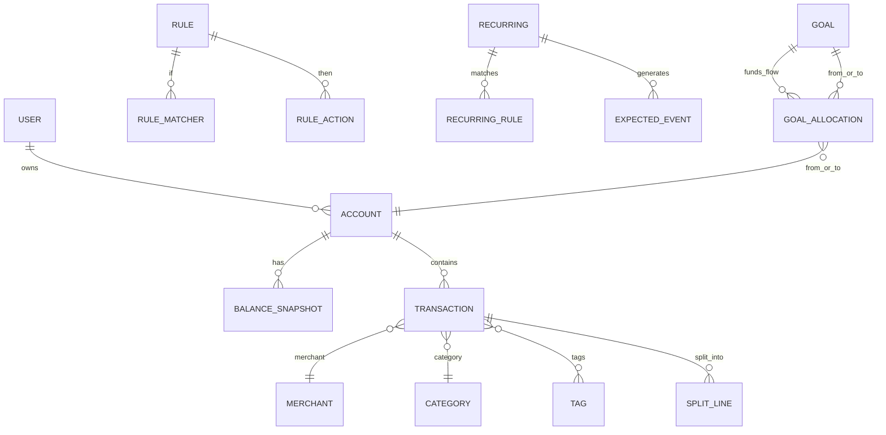

# Personal Finance Management Apps as Reusable Agent Skills

## Executive summary

Consumer personal-finance apps cluster into two product philosophies that strongly shape their UX, data models, and automation surfaces.

The first philosophy is **plan-first, constraint-based budgeting**, where the user deliberately allocates finite dollars and treats the budget as an “operational system” for day-to-day decisions. **YNAB** is the clearest exemplar: it explicitly frames budgeting as *zero-based* (“assign every dollar until none are unassigned”) and as a digital evolution of the envelope system.  This philosophy tends to produce UX patterns such as “assign dollars,” “underfunded/overspent” state visualizations, and intentional friction (review, approve, reconcile) that increases data accuracy and habit formation. 

The second philosophy is **track-first, automation-heavy “money clarity”**, where the core goal is reducing input burden: auto-import, auto-categorize, and present dashboards, rollups, and goals with minimal ceremony. **Copilot Money**, **Monarch Money**, and **Origin** reflect this family, each with its own stance on how “budgeting” should feel: Copilot can even disable budgeting and behave like a spend tracker; Monarch’s default “Flex Budgeting” intentionally collapses dozens of categories into three buckets (Fixed / Non-monthly / Flex) to reduce micromanagement; Origin leans into guided setup (AI Budget Builder) and broader “financial OS” scope (including planner/AI guidance and other services). 

Across these products, the most reusable agent skills are *not* the brand-specific screens, but the recurring technical primitives:

- **Transaction ingestion + normalization** (from bank feeds, CSV exports/imports, manual entry).
- **Entity resolution** (merchant normalization, category taxonomy management).
- **Rules + learning loops** (user edits become deterministic rules; ML suggestions become explainable).
- **Reconciliation and deduplication** (matching imported vs manually-entered transactions; handling pending vs posted).
- **Recurring and “true expense” modeling** (sinking funds, non-monthly expenses, rollovers).
- **Goal accounting** (virtual buckets mapped to real accounts via allocations, with “spending reduces progress” behaviors).
- **Privacy/security constraints** (read-only connections, multi-factor authentication, encryption, SOC 2 posture).

The report below documents feature sets, workflows, and decision tradeoffs so those primitives can be replicated as durable, reusable skill modules without integrating with the original apps.

## Methodologies and design tradeoffs

### Budgeting models as interaction contracts

These apps differ less in “features” than in the *contract they make with the user* about what the numbers mean.

**Zero-based / envelope-derived (YNAB).**  
YNAB explicitly ties its method to zero-based budgeting (“assign every dollar until there are zero unassigned dollars”) and positions the envelope system as the conceptual ancestor (“digital, much more convenient version”).  This contract implies: the budget is not a forecast; it is a plan for dollars you already have, with intentional categorization and regular reconciliation to ensure the register reflects reality.   
**Tradeoff:** higher accuracy and stronger behavioral change at the cost of more user attention per transaction and more conceptual onboarding. 

**Category budgeting with optional rollovers and grouping (Copilot, Monarch).**  
Copilot centers “smart categorization,” rollovers, budget rebalancing suggestions, and cash-flow summaries—more “adaptive tracking” than strict allocation.   
Monarch supports traditional category budgeting but emphasizes two distinctive simplifications: *Group budgeting* (budget at a group level instead of each category) and *Flex budgeting* (Fixed / Non-monthly / Flex buckets + a single “flex number” that need not equal the sum of category budgets).   
**Tradeoff:** lower operational friction, but weaker guarantees that the “budget remaining” is decision-safe unless reconciliation/transaction review discipline is maintained.

**Rule-based + guided budgeting (Origin).**  
Origin’s documentation emphasizes automatic categorization, transaction rules (filter by merchant/category/amount), and guided budget creation with historical averages plus an “AI Budget Builder” scanning ~6 months of cash flow.   
**Tradeoff:** faster onboarding and “reasonable default budgets,” but increased dependency on correct historical labeling and stable account connectivity (especially if the app encourages heavy automation).

### Connectivity-driven constraints

All four products treat connectivity as foundational, but they surface different responses to data-provider variability (broken connections, missing merchants, duplicates).

- Monarch explicitly discloses it uses multiple data providers—,  (owned by ), and —and frames this as coverage/reliability optimization. 
- Origin similarly supports switching among Plaid, MX, and Finicity when a connection fails. 
- YNAB publicly notes Direct Import coverage varies by region and has added a new provider for European connections; Plaid also publishes a case study describing YNAB’s European migration and resulting changes in conversion/error rates. 
- Copilot explicitly limits coverage to US institutions and does not support currency conversion beyond USD. 

From a reusable-skills perspective, these disclosures imply the agent layer must treat “bank feed truth” as **eventually consistent and sometimes wrong**, requiring first-class skills for deduplication, reconciliation, and “human-in-the-loop review queues” rather than assuming pristine data.

## Comparative feature matrix

The matrix below is scoped to the four apps you named. Where a cell says “limited” or “by workaround,” that typically implies extra transformation logic is needed in reusable skills (e.g., multi-currency normalization, goal funding, or forecast projections).

| Category | YNAB | Copilot Money | Monarch Money | Origin |
|---|---|---|---|---|
| Budgeting model | Zero-based + envelope-derived “give every dollar a job” | Category budgets *or* optional “no budgeting” tracking mode | Two systems: Category budgeting and default Flex Budgeting (Fixed/Non-monthly/Flex) | Category budgeting + guided setup; AI Budget Builder proposes budgets |
| Transaction import & reconciliation | Direct Import + file-based import; explicit reconciliation UX (“Reconcile with Direct Import”) | Automated imports + “To Review” workflow; exports include pending/posted status | Automated syncing via multiple providers; “Reviewed” marking; CSV imports and downloads (web) | Connected accounts + export; troubleshooting guidance includes provider switching; duplicate handling guidance |
| Categorization & auto-tagging | Category + payee workflows; method emphasizes deliberate categorization | “Copilot Intelligence” ML suggestions; deterministic name rules | Auto-categorization + explicit transaction rules; tags; merchant merge tools | Auto-categorization + transaction rules (merchant/category/amount filters) |
| Forecasting & cashflow | Explicitly distinguishes budgeting vs forecasting; generally plan-with-current-dollars | Dashboard net/income views and cash flow framing | Cash flow + planning focus; Flex budgeting emphasizes simplified planning | AI Budget Builder uses past cash flow; spending views compare months |
| Goals & sinking funds | Targets (“needed for spending,” “top-up,” custom cadence; snooze) | Recurrings + rollovers support multi-month tracking; shared-recurring patterns | Goals 3.0 “save up goals” as virtual buckets with projections, allocations, and “spending reduces progress” options | Savings goals currently described as category/transfer-based workarounds; AI budget builder offers savings slider |
| Investment tracking | Budget-centric; can track accounts but not positioned as investment OS | Investment holdings/performance + real estate value tracking (product positioning) | Investment performance tracking marketed; plus integrations list | Investment monitoring + investment management positioned (marketing + support emphasis) |
| Bills & subscriptions | Scheduled transactions supported; not positioned as subscription detector | “Recurrings” feature with expected spend views; upcoming recurrings on dashboard | Recurring transaction tracking; subscription emphasis in marketing | Spending/subscription management positioned; budgeting setup supports rules |
| Multi-account / currency | Single base currency per plan; Direct Import supports select regions | US only; USD only; no FX conversion | US + Canada; recommends USD/CAD only; no currency conversion | Supports multiple aggregators; currency handling not documented as multi-currency conversion |
| Reporting & visualizations | Reports historically core; method metrics like “Age Your Money” concept | Category charts with spending-rate visualization | Custom reporting + visualizations; budgeting/goal projections | Spending and budget views; exports for offline analysis |
| Security/privacy (high level) | Detailed security page; encryption in transit/at rest; banking aggregation partners; bug bounty | AES-256 at rest + TLS in transit; privacy-first stance; data export controls | SOC 2 Type II; encryption at rest/in transit; US-based AWS storage; MFA; explicit provider list | AES-256 encryption; MFA; SOC 2 Type II audited/certified in docs; AI Advisor privacy posture |
| Availability | Web + iOS + Android noted in feature rollouts | iPhone/iPad/Mac + Web (Dec 2025); US-only | Web + iOS + Android + iPad; US + Canada | Web dashboard + mobile app flows described; membership subscription model |
| Pricing / business model | Subscription: $109/yr or $14.99/mo (USD) | Subscription: $95/yr or ~$13/mo (US) | Subscription: $99.99/yr or monthly; promos common | Subscription: $12.99/mo or $99/yr; annual includes discounts on premium services |

Matrix sources are primarily official pricing, security, and help-center materials for each app. 


## App deep dives

### YNAB

YNAB is a paradigmatic **method-led** product: the app is designed to enforce and reinforce a budgeting methodology rather than simply present data. It is explicit about zero-based budgeting (“Give every dollar a job”) and frames envelope budgeting as its behavioral ancestor, implemented digitally. 

#### Methodology and core workflow

The “Four Rules” framing (including concepts like rolling with the punches and aging your money) drives the workflow: budget dollars you currently have, adjust when reality changes, and progressively build a buffer.   
A defining product decision is the explicit distinction between *budgeting with current dollars* and *forecasting future dollars*, which appears even in YNAB’s glossary and educational content. 

A representative user flow:

1. **Onboard to a budget currency and plan scope.** YNAB supports selecting a currency but does not support multiple currencies in a single “spending plan.”   
2. **Connect accounts (Direct Import) or use file-based import.** Direct Import supports select US, Canadian, UK, and EU banks; file-based import exists as a fallback.   
3. **Assign dollars (“give every dollar a job”).** Categories become digital envelopes.   
4. **Enter/approve/categorize transactions and keep the register trustworthy.** Reconciliation is emphasized as essential to “agreement with your bank’s records.”   
5. **Handle “true expenses” via targets.** YNAB targets support behaviors like repeating targets vs “top-up to a balance,” custom cadence, and “snooze” for atypical months.   
6. **Use scheduled transactions for predictable bills.** YNAB explicitly recommends scheduled transactions for fixed, recurring bills. 

#### Unique UX patterns worth replicating

- **Intentional friction + explicit state:** approvals/review; underfunded/overspent alerts; reconcile flows.   
- **Targets as “true expense compilers”:** target behaviors encode whether to accumulate surplus or reset to a cap (“top-up”)—this is a reusable semantic primitive for sinking funds.   
- **Budget vs forecast boundary:** the product repeatedly frames forecasting as riskier than budgeting, which affects UI choices (e.g., avoiding reliance on future income). 

#### Automation surfaces and limitations

YNAB offers Direct Import enhancements for reconciliation (showing whether linked balance matches the bank and enabling one-click reconcile when it does).   
It also offers a public API (REST/JSON over HTTPS) with concepts like “server_knowledge” delta sync and endpoints for budgets/accounts/categories/transactions/scheduled transactions. 

Key limitations that affect reusable-skill design:

- **Multi-currency constraint:** single base currency per plan.   
- **Import provider variability by region:** YNAB added Plaid as a European direct import provider and works with aggregation specialists; the public-facing narrative is that data comes via partners and credentials are not stored by YNAB. 

#### Typical personas

- **Behavior-change seekers:** users who want a method and are willing to “do the work” to gain control (strong fit with plan-first experience).   
- **Irregular-income / true-expense planners:** targets and scheduled transactions are designed to make non-monthly expenses predictable.   
- **Privacy-sensitive subscription buyers:** YNAB explicitly frames subscription revenue as the business model and emphasizes not selling user financial data. 

### Copilot Money

Copilot is a design-forward, automation-heavy tracker that supports budgeting but does not require it. Its public positioning emphasizes “AI-powered spending categorization,” rollovers, cash flow summaries, and a rich investments view. 

#### Methodology and core workflow

Copilot’s model can be understood as **review-first with optional planning**:

1. **Import accounts (US-only).** Copilot states it only supports US institutions and is only available in the US App Store; the web app is also described as US-only.   
2. **Review loop:** new transactions land in “To Review”; once enough transactions are reviewed, Copilot Intelligence begins suggesting categories/types and improves with feedback.   
3. **Optional budgeting:** budgeting can be disabled, shifting the product into “compare this month to last month” mode rather than against preset budgets.   
4. **Recurrings and rollovers:** users can set recurring schedules and carry remaining category balances across months.   
5. **Budget adaptation:** “Rebalancing” suggests category budget adjustments while keeping the same overall total budget. 

This is closer to a “data-driven coach” than a strict envelope system: the tool stays useful even if the user doesn’t pre-plan every category.

#### Unique UX patterns worth replicating

- **“To Review” as a first-class queue:** this transforms categorization into a triage workflow rather than a periodic clean-up task.   
- **Spending-rate visualization:** Copilot’s categories and dashboard emphasize “pace” (ideal spending rate lines; bar colors for on-track vs over pace).   
- **Rule prompt at the moment of correction:** when correcting categories, Copilot can create name rules (exact or partial match).   
- **Budget flexibility via rollovers and “budget by month” modes:** supports stable budgets across months or changing budgets month-to-month, with rollovers interacting with historical budgets. 

#### Automation rules and system behaviors

Copilot has three “automation layers” that map cleanly into reusable skills:

- **ML suggestions (“Copilot Intelligence”).** Learns from user edits to improve future predictions.   
- **Deterministic rules (name matching).** Exact/partial name rules for categorization; partial rules help with name variance like “GasBill032020” patterns.   
- **Structured recurrings.** Recurring schedules can be monthly, weekly, bi-weekly, yearly, or non-monthly; the system estimates frequency from selected transaction history and marks recurring matches. 

Copilot also documents a specific pattern for reimbursements on shared recurring expenses: represent the payment and the reimbursement as two recurrings in the same category, so net spend matches the user’s true cost. 

#### Constraints that matter for skill design

- **Currency constraint:** Copilot only supports USD and does not convert foreign currency; any non-USD transactions appear as USD per data-provider output, with manual editing as a workaround.   
- **Export model:** Copilot exports a CSV including pending/posted status, categories, notes, account mask, excluded flag, and associated recurrings—this is a useful reference schema for agent interoperability.   
- **Web app parity:** as of December 2025, Copilot’s web app exists but lacks some tabs/actions (e.g., goals, cash flow tab, name rules, splits) with plans to add them in 2026. 

#### Typical personas

- **Hands-off optimizers:** want accuracy with minimal manual categorization; willing to review a queue rather than pre-plan.   
- **Apple-ecosystem users / design-sensitive users:** Copilot positions itself as available on iPhone/iPad/Mac/Web with design awards and premium UI emphasis.   
- **Spending-awareness users:** those who benefit from “pace” visualizations and quick recategorization without adopting a full envelope method. 

### Monarch Money

Monarch’s positioning is “home base for money clarity,” with strong emphasis on cross-device availability, collaboration, and account connectivity breadth. 

#### Methodology and core workflow

Monarch offers **two budget interaction models**:

- **Category budgeting (traditional):** set budgets per category, with options for rollovers; categories can be excluded from the budget.   
- **Flex budgeting (default):** group expenses into Fixed, Non-monthly, and Flex, then manage flexible spending via a single “flex number” that does not have to match category budget sums; categories in the Flex bucket may have no individual budgets and still count against the flex number. 

A representative end-to-end flow:

1. **Connect unlimited accounts (US/Canada).** Monarch states availability is US and Canada; it recommends connecting only USD/CAD accounts because it does not perform currency conversion and does not differentiate currencies behind the scenes.   
2. **Transactions arrive + “review” process.** Monarch supports marking transactions as reviewed; rules can also set review status.   
3. **Normalize merchants and categories.** Monarch supports editing transactions, split/hide/mark review, and merging merchant names via a merchant settings area.   
4. **Automate via transaction rules.** Rules run on new, non-pending transactions and can rename merchant, change category, add tags, hide, set review status, or link to goals.   
5. **Budget planning.** Use either category budgets (with rollovers and group budgeting) or Flex budgeting for simplified control.   
6. **Goals and allocations.** Monarch’s Goals 3.0 introduces “save up goals” as dedicated money buckets with projections, funds allocations, and configurable “spending reduces progress,” plus reconciliation semantics when you spend from credit while savings sit elsewhere. 

#### Unique UX patterns worth replicating

- **Flex budgeting as a cognitive-load reducer:** the “flex number” decouples from category sums and acts as a single control knob for discretionary spending.   
- **Rules as a composable automation DSL:** the rule system is unusually expressive for a consumer app (merchant/original statement matching, ranges, tags, hiding, goal linking, review status).   
- **Goals as virtual buckets mapped onto real accounts via allocations:** Monarch explicitly models “available, allocated, over-allocated,” and prevents allocating more than what’s available, enforcing conservation of funds across goals and accounts. 

These patterns are directly reusable as agent skills: “bucket budgets,” “automation DSL,” and “virtual goal ledger.”

#### Import/export and interoperability features

Monarch supports both **manual CSV import** of transactions (web only) and downloads of transactions and balance history (with practical limits and warnings: CSV imports cannot be undone; large files should be split by account/date).   
This documentation is particularly useful for skills because it reveals operational constraints—e.g., batch sizes, irreversibility, and the need for test imports—that generalize to any agent-driven import pipeline. 

#### Security/privacy posture

Monarch’s help center states it is SOC 2 Type II certified, encrypts data at rest and in transit, stores data in US-based AWS data centers, and offers MFA; it also details that it does not store bank credentials, which flow through third-party providers.   
The explicit data-provider list (Plaid/Finicity/MX) and optional  integration for credit information are documented. 

#### Typical personas

- **Couples/households:** Monarch markets unlimited collaborators and shared views; rules + shared views are suggested for granularity.   
- **Users seeking “Mint-like” aggregation + planning:** Monarch’s positioning as a Mint successor is reinforced by the broader ecosystem context after  announced Mint’s shutdown and encouraged users to onboard to .   
- **Users overwhelmed by category micromanagement:** Flex budgeting is explicitly built for variable expenses and unpredictable month-to-month spending. 

### Origin

Origin is positioned as an “all-in-one” personal finance platform with budgeting, net worth, investments, and access to planner-like services (including “AI-powered guidance” and discounted sessions with CFP® professionals on annual membership). 

#### Methodology and core workflow

Origin’s budgeting experience emphasizes guided construction using historical baselines:

- **Manual budget setup:** enter monthly income, set savings goals (percent or dollars), add category targets with historical averages, and see remaining amount to avoid over-budgeting; miscategorized transactions can be corrected during setup, creating rules.   
- **AI Budget Builder:** scans ~6 months of income/spend to generate a recommended budget with an interactive savings slider and category suggestions; it can update an existing budget starting immediately and for future months. 

This is effectively a “bootstrap budget from history” methodology: use observed cashflow as a prior, then allow the user to adjust constraints.

#### Automation and rule surfaces

Origin’s Spending feature documentation explicitly calls out:

- automatic categorization,
- monthly views comparing current vs previous months,
- custom category groups,
- transaction rules filtering by merchant/category/amount,
- export capabilities, and
- optional AI budget insights/adjustments. 

#### Connectivity, duplicates, and reliability behaviors

Origin supports account connections through Plaid/MX/Finicity and surfaces the ability to switch when a connection fails.   
It also documents common causes of duplicate transactions—especially connecting the same account through more than one aggregator or through partner profiles—and recommends checking connections and potentially reconnecting via another provider; it also warns that removing an account “may result in loss of historical transaction data.”   
This “duplicates + provider switching + potential history loss” triad is an important design lesson for reusable skills: reconciliation and dedupe must be conservative, and destructive actions must require strong confirmations and backup/export affordances.

#### Pricing model and premium-service coupling

Origin documents membership options: monthly ($12.99/mo) and annual ($99/yr), with annual members receiving discounts on premium services like CFP® sessions and estate plans.   
This coupling (subscription + marketplace discounts) affects product incentives and can influence which “insights” are surfaced in UX.

#### Security/privacy posture

Origin’s help center states it uses AES-256 encryption, MFA, and SOC 2 Type II auditing/certification; it positions itself as both a personal finance tool and a provider of investment accounts, which elevates the importance of compliance posture.   
It also provides guidance on “AI Advisor” privacy: the AI draws from connected accounts, partner data in joint plans, and a risk profile questionnaire, and maintains chat history. 

## Data inputs/outputs, transformations, normalization rules, and reconciliation edge cases

This section abstracts across apps to define **a reusable financial data pipeline** suitable for agent skills.

### Canonical entities and relationships

A stable “personal finance OS” schema can be expressed as: Accounts hold Transactions; Transactions reference Merchants and Categories; Rules transform transaction attributes; Recurring schedules and Goals provide planning overlays; Reconciliation binds internal balances to external statements (or provider balances).



This ER model is consistent with documented features: Monarch’s rules DSL and goal allocations, Copilot’s recurrings and name rules, YNAB’s scheduled transactions/targets, and Origin’s transaction rules and budget builder. 

### Inputs and outputs

**Typical inputs (agent must accept):**

- **Provider-synced transaction stream.** Monarch and Origin both explicitly route credentials through third-party providers and receive transactions/balances from them.   
- **CSV imports or exports** from apps and banks. Monarch supports CSV imports with required formats and warns imports cannot be undone; Copilot exports transactions to CSV with a specific column set; Origin supports exporting spending data to CSV.   
- **Manual transactions.** Copilot allows manual transactions and edits from a transaction detail view.   
- **Recurring metadata.** Copilot’s recurrings include schedule frequency and filter settings; Monarch’s recurring transactions have constraints like “one recurring per merchant.”   
- **Budget/goal configurations.** YNAB targets (with “top-up” and custom cadence) and Monarch goals (targets, dates, monthly contributions, “spending reduces progress”) introduce structured planning parameters. 

**Typical outputs (agent should produce):**

- **Normalized transaction ledger** (canonical schema).  
- **Audit trail and explainability artifacts:** which rule/ML suggestion changed what and why (Monarch supports rule preview and ordering; Copilot’s intelligence learns from edits).   
- **Budget state snapshot:** per-category/group remaining, rollover carry, under/over pace (Copilot and Monarch both explicitly model rollovers).   
- **Goal state snapshot:** goal balances, projections/status, and allocations (Monarch Goals 3.0 semantics).   
- **Exports:** CSV/JSON bundles for backup or downstream analysis; Copilot and Monarch emphasize export as a user control. 

### Required transformations and normalization rules

A robust transformation pipeline should include the following stages.

**Parsing and field normalization**

- Normalize dates to `YYYY-MM-DD` in a single timezone; preserve original posted date separately if available (Copilot export includes status pending/posted).   
- Normalize amounts to a single sign convention (e.g., expenses negative, income positive). Monarch’s import guidance explicitly notes sign conventions for income vs expenses.   
- Standardize account identifiers: provider account IDs (if present), local stable account IDs, masked numbers (Copilot export includes Account Mask). 

**Merchant normalization (entity resolution)**

- Create a `merchant.canonical_name` separate from `transaction.original_statement`. Monarch explicitly supports rules that match on merchant or original statement and offers merchant merge tools.   
- Maintain a many-to-one map from statement variants → canonical merchant (Copilot partial matching rules are designed for varied merchant strings). 

**Categorization and tagging**

- Model category hierarchies (parent group + leaf category). Copilot exports both Category and Parent Category, making this a practical interoperability standard.   
- Support per-transaction `excluded` semantics (exclude from budgeting totals vs keep in ledger). Copilot exports an Excluded boolean; Monarch’s rules can hide transactions from budget and cash flow. 

**Rules and precedence**

- Maintain deterministic rule ordering and traceability. Monarch explicitly runs rules in order and allows reordering; rules apply to new, non-pending transactions.   
- Support rule actions beyond category: rename, hide/exclude, tags, review status, and goal linking.   
- Separate “ML suggestion” from “rule decision”: Copilot Intelligence provides suggestions that the user can accept/edit, and the system learns from edits. 

### Deduplication and reconciliation edge cases

Your skills should treat reconciliation as a first-class process, not an afterthought, because all four apps tolerate imperfect upstream data.

Key edge cases repeatedly implied by documentation:

- **Same account connected through multiple data providers** → duplicates. Origin names this explicitly as a common cause of duplicates.   
- **Pending vs posted duplicates or mismatches.** Copilot exports a pending/posted status; Monarch rules only apply to non-pending transactions; this implies different matching logic for pending lines.   
- **Merchant relabeling changes** can cause apparent duplicates or rule misfires (Origin notes institutions changing labeling/reporting can produce duplicates).   
- **Recurring subscriptions with the same merchant** cannot always be separated by rules in Monarch if statement strings and amounts are identical; this requires manual handling or merged recurrence modeling.   
- **Foreign currency transactions** in USD-only systems: Copilot notes non-USD transactions appear as USD amounts from the provider; without FX conversion, totals become misleading.   
- **Mixed currencies without conversion**: Monarch explicitly warns that it does not differentiate currencies “behind the scenes,” producing misleading totals when mixing currencies.   
- **Reconciliation semantics differ by methodology:** YNAB emphasizes reconciling the register to match bank truth; it even added “Reconcile with Direct Import” to streamline this. 

A reusable agent should implement a conservative two-stage matching strategy:

1. **Hard match keys** (best effort): `(account_id, amount, date_window, normalized_payee)` with a pending/posted-aware window.  
2. **Soft match scoring** using merchant similarity and memo/statement similarity, but requiring user confirmation when confidence is below a threshold.

## Prioritized reusable skill capabilities

This section translates observed product behaviors into a **skill catalog** that can be implemented as modular agent skills. Because the referenced `skills.sh` and `agents.md` conventions were not available in connected sources for this conversation, the mappings below are presented as a practical, adaptable template (you can rename fields to match your repo’s exact conventions).

### Skill catalog

The ordering reflects what the apps implicitly treat as foundations (import → normalize → reconcile → categorize → budget → goals → insights).

#### Ingestion and ledger integrity

**Skill: `txn_ingest` (priority: highest)**  
Purpose: Accept transactions from CSV exports, manual entry, or provider streams; produce raw ledger events.

- **Inputs:** `RawTransaction[]` (CSV rows, JSON events)  
- **Outputs:** `StagedTransaction[]` with parse diagnostics  
- **Validation rules:** required fields, parseable dates, numeric amounts; detect mixed sign conventions (Monarch’s import format notes sign conventions explicitly).   
- **Error handling:** partial row acceptance + error report; “cannot undo” warning semantics mirrored from Monarch CSV import guidance. 

**Skill: `txn_normalize`**  
Purpose: Normalize amounts, dates, status (pending/posted), original statement vs canonical merchant fields.

- Include `pending_status` because Copilot exports it, and Monarch rules differentiate pending vs non-pending. 

**Skill: `txn_dedupe_match`**  
Purpose: Identify duplicates and match imported transactions with existing ones (especially manual vs imported) using conservative heuristics.

- Include explicit case: duplicates from multi-aggregator connections (Origin).   
- Produce a “review queue” for ambiguous matches rather than auto-deleting.

**Skill: `account_reconcile`**  
Purpose: Compare internal register balances to external statement/bank balances; generate reconciliation adjustments only when necessary.

- Mirror YNAB’s emphasis that reconciliation ensures agreement with bank truth, and its “linked balance match” UX. 

#### Categorization and automation

**Skill: `merchant_resolve`**  
Purpose: Map statement strings to canonical merchants; maintain alias maps; support merges.

- Model explicit “original statement” as separate field, since Monarch rules can match on it. 

**Skill: `categorize_suggest`**  
Purpose: Provide ML-like suggestions but keep them explainable (Copilot Intelligence concept).   
- Output must include “reason codes” (e.g., “learned from 27 prior edits”, “rule matched: ‘contains WALMART’”).

**Skill: `rules_apply`**  
Purpose: Deterministic rule engine with ordering, matchers, and actions.

- Must support actions similar to Monarch: rename merchant, update category, add tags, hide/exclude, set review status, goal link.   
- Ensure rules only apply to “new” and (optionally) only “posted” transactions unless configured (Monarch specifies non-pending). 

#### Recurring and planning overlays

**Skill: `recurring_detect_and_schedule`**  
Purpose: Detect recurring patterns from history; generate expected events and “upcoming” views.

- Copilot allows weekly/bi-weekly/monthly/non-monthly schedules; Monarch has recurring constraints by merchant.   
- Must support “shared recurring reimbursements” pattern as a reusable template (two recurrings in same category: payment and credit). 

**Skill: `budget_compute`**  
Purpose: Compute budget remaining and pacing with support for:
- rollovers (Copilot/Monarch)   
- group budgeting rollups (Monarch)   
- optional “no budgeting” tracking mode (Copilot)   
- method-led allocation mode (YNAB-style) with “to assign” and underfunded categories (targets). 

**Skill: `goal_ledger`**  
Purpose: Implement virtual goal buckets and allocations mapped to real accounts.

- Monarch’s Goals 3.0 is a strong reference: goals have target amount/date/monthly contribution, projections/status, allocations, and an option for whether spending reduces progress.   
- Must enforce conservation: cannot allocate more than available. 

#### Insights and reporting

**Skill: `insights_generate`**  
Purpose: Produce reports (category trends, cash flow, net worth) and plain-language explanations.

- Copilot and Monarch emphasize charts, cash flow, and summaries; Origin compares months and offers insights via AI builder. 

**Skill: `export_bundle`**  
Purpose: Export normalized ledger state (transactions, rules, categories) to CSV/JSON for portability.

- Align with Copilot’s export fields for transactions; align with Monarch’s bulk download and file-size guidance. 

### Suggested schemas and function signatures

Below are example function signatures (language-agnostic) you can adapt for your agent toolchain.

```text
txn_ingest(source: IngestSource, payload: bytes|rows, opts: IngestOptions) -> IngestResult
txn_normalize(staged: StagedTransaction[], opts: NormalizeOptions) -> NormalizedTransaction[]
txn_dedupe_match(existing: NormalizedTransaction[], incoming: NormalizedTransaction[], opts) -> MatchResult
account_reconcile(account: Account, ledger: NormalizedTransaction[], statement_balance: Money, as_of: Date) -> ReconcilePlan

rules_apply(txns: NormalizedTransaction[], rules: Rule[], context: RuleContext) -> RuleApplyResult
categorize_suggest(txns: NormalizedTransaction[], model: SuggestModel, history: UserEdits) -> Suggestion[]
merchant_resolve(txns: NormalizedTransaction[], merchant_map: MerchantMap) -> MerchantResolutionResult

recurring_detect_and_schedule(txns: NormalizedTransaction[], opts: RecurringOptions) -> RecurringPlan
budget_compute(txns: NormalizedTransaction[], config: BudgetConfig, period: Month) -> BudgetSnapshot
goal_ledger(txns: NormalizedTransaction[], allocations: Allocation[], goals: Goal[], period: Month) -> GoalSnapshot

insights_generate(budget: BudgetSnapshot, goals: GoalSnapshot, networth: NetWorthSnapshot, opts) -> Insight[]
export_bundle(state: FinanceState, format: "csv"|"json") -> ExportArtifacts
```

### Example prompts for coding agents

These are “starter prompts” designed to generate implementation-ready code while keeping behavior aligned with the research above.

**Prompt for Codex / Claude Code / OpenCode: Rule engine**

> Implement a deterministic transaction rule engine for a personal finance ledger.  
> Requirements:  
> - Rule matchers: merchant canonical name (exact/contains), original statement (exact/contains), amount predicates (==, >, <, range), category filter, account filter, pending_status filter.  
> - Actions: rename_merchant, set_category, add_tags, set_excluded(bool), set_review_status(enum), link_goal(goal_id).  
> - Rules run in list order; produce an audit log per transaction recording which rules fired and what fields changed.  
> - Rules should only apply to posted transactions by default (pending ignored unless explicitly enabled).  
> - Provide unit tests covering ordering, overlapping rules, and a case where “original statement” matching differs from canonical merchant matching.  
> Output: TypeScript module + tests.

**Prompt: Deduplication and matching**

> Build a dedupe + match module for bank transactions.  
> Inputs: existing normalized transactions, incoming normalized transactions.  
> Output: (a) matched pairs, (b) new transactions, (c) suspected duplicates, (d) ambiguous matches requiring review.  
> Heuristics:  
> - Hard-match if same account_id + same amount + date within ±3 days + merchant similarity ≥ 0.85.  
> - Pending/posted: allow pending→posted matching when amount equal and dates within ±7 days; otherwise do not auto-match.  
> - Block auto-dedupe if transactions come from different “data_source” providers (risk of multi-provider duplicates).  
> Provide metrics: precision/recall estimates computed on a synthetic labeled dataset you generate in tests.

**Prompt: Flex budgeting + rollovers**

> Implement budget_compute supporting:  
> - Flex budgeting (Fixed / Non-monthly / Flex buckets) with a single “flex_number” that is independent of summed category budgets.  
> - Category budgeting with optional rollovers per category.  
> - Excluded/hidden transactions do not count toward budget totals but remain searchable in the ledger.  
> Provide snapshot outputs for a month including: total_budget, total_spent, remaining_by_bucket, remaining_by_category, rollover_carry.  
> Include tests for rollover accumulation across 3 months.

## Testing, success metrics, and sample datasets

### Recommended test cases

The following tests are prioritized because each is grounded in real documented constraints from these apps.

**Connectivity and duplication**

- Same account connected through two providers → duplicates appear; ensure dedupe does *not* auto-delete without confirmation (Origin duplicate causes).   
- Pending transaction later posts with a slightly changed merchant string; should match pending→posted if allowed; otherwise route to review (Copilot pending/posted export; Monarch rules ignore pending).   
- Merchant string changes at institution level produce rule misses; verify original statement matching remains available (Origin notes labeling changes; Monarch rules can match original statement). 

**Rules and explainability**

- Two rules match the same transaction; ensure ordering produces deterministic final state (Monarch rule ordering).   
- Rule preview: generate a “dry run” diff list for a batch (Monarch supports preview changes).   
- Copilot-like name rule creation from a correction: converting an edit into an exact/partial rule, and retroactively applying it to past transactions. 

**Budget math**

- Rollovers accumulate overspend/underspend across months (Copilot and Monarch both document cumulative rollovers).   
- Flex budgeting where flex bucket number is higher than sum of category budgets; ensure total budget uses the flex bucket number, not category sums.   
- Optional budgeting mode: compute spend vs last month, not vs budgets (Copilot). 

**Goals**

- Virtual goal funding with “spending reduces progress” on/off; ensure goal progress is reduced only when configured (Monarch save up goals).   
- Allocation constraints: cannot allocate more than available; enforce by validation rule (Monarch).   
- “Reconciliation” of goal spending when purchase is on credit while funds sit in savings (Monarch’s explanation). 

**Currency**

- Mixed currency transaction ingestion in a USD-only system: ensure warnings and non-converted totals (Copilot, Monarch). 

### Metrics for success

A reusable skill suite should track both correctness and user-experience outcomes.

**Ledger correctness**

- **Reconciliation pass rate:** % of accounts where computed balance equals statement/bank balance at reconciliation checkpoints (YNAB emphasizes this as foundational).   
- **Deduplication precision/recall:** avoid false deletions; prioritize high precision even at cost of more review items (driven by Origin’s duplicate causes and multi-provider risk).   
- **Rule determinism rate:** identical inputs always yield identical outputs (Monarch ordering model). 

**Automation quality**

- **Auto-categorization acceptance rate:** fraction of suggestions accepted without edits (Copilot Intelligence concept).   
- **Time-to-inbox-zero:** how quickly “To Review” queues clear (Copilot workflow).   
- **Recurring detection accuracy:** match rate for recurring schedules; false merges for same-merchant subscriptions (Monarch limitation). 

**User-perceived value**

- **Planning confidence proxy:** reduction in “surprise charges” events (detected as uncategorized + no-recurring + high amount), tied to recurring/scheduled tooling.   
- **Onboarding completion rate:** for guided budget builders like Origin’s AI Budget Builder scanning 6 months of data. 

### Sample datasets

Below are small synthetic datasets designed to exercise the edge cases above. They are intentionally not tied to any app integration.

**Dataset: `transactions_edge_cases.csv` (conceptual)**

```csv
date,account_id,account_name,amount,currency,status,original_statement,merchant_guess,category_guess,notes,source_id
2026-01-03,chk_1,Checking,-12.34,USD,pending,"SQ *COFFEE#1042 NY","Coffee Shop","Dining","pending auth",provA:tx_001
2026-01-05,chk_1,Checking,-12.34,USD,posted,"SQ *COFFEE #1042 NEW YORK","Coffee Shop","Dining","posted settlement",provA:tx_009
2026-01-07,cc_1,Credit Card,-120.00,USD,posted,"AMZN Mktp US*2F8K1","Amazon","Shopping","needs split by items",provA:tx_010
2026-01-10,chk_1,Checking,2500.00,USD,posted,"PAYROLL ACME INC","Employer Payroll","Income","biweekly",provA:tx_011
2026-01-12,chk_1,Checking,-95.00,USD,posted,"GAIA GPS ANNUAL","Gaia","Subscriptions","annual recurring",provA:tx_012
2026-01-12,chk_1,Checking,-95.00,USD,posted,"GAIA GPS ANNUAL","Gaia","Subscriptions","duplicate via second provider",provB:tx_998
2026-01-15,chk_1,Checking,-1000.00,JPY,posted,"TOKYO HOTEL 1-15","Tokyo Hotel","Travel","non-USD should warn",provA:tx_013
2026-01-20,chk_1,Checking,75.00,USD,posted,"REFUND - AMZN Mktp US*2F8K1","Amazon","Shopping","refund",provA:tx_014
```

**Expected behaviors:** pending→posted match for the coffee transaction; duplicate detection for Gaia across providers; currency warning for JPY; refund handling.

**Dataset: `rules.json` (conceptual)**

```json
[
  {"id":"r1","if":{"original_statement_contains":"AMZN"},"then":{"rename_merchant":"Amazon","add_tags":["retail"]}},
  {"id":"r2","if":{"merchant_exact":"Amazon","amount_lt":0},"then":{"set_category":"Shopping"}},
  {"id":"r3","if":{"merchant_exact":"Amazon","amount_gt":0},"then":{"set_category":"Refunds"}}
]
```

**Dataset: `goals.json` (conceptual)**

```json
[
  {"id":"g_emergency","name":"Emergency Fund","target_amount":5000,"target_date":"2026-12-31","monthly_contribution":250,"spending_reduces_progress":true},
  {"id":"g_vacation","name":"Vacation","target_amount":2000,"target_date":"2026-08-01","monthly_contribution":200,"spending_reduces_progress":false}
]
```

## Source comparison table

The table below lists the most relied-upon sources, prioritized toward official docs/help centers, with a smaller number of authoritative third-party context sources.

| Topic | Primary sources | Why these sources were prioritized |
|---|---|---|
| YNAB pricing, currency constraints | YNAB pricing FAQs  | Official pricing and explicit statement about single-currency-per-plan |
| YNAB method & terminology | YNAB zero-based budgeting + envelope + dictionary  | Official definitions of budgeting model and terms |
| YNAB reconciliation and scheduled transactions | “Reconcile with Direct Import” + reconciling emphasis + scheduled transactions guidance  | Direct documentation of ledger-trust workflow |
| YNAB security/privacy and import aggregation posture | YNAB Security + Privacy Policy  | Detailed official security statements and business model framing |
| Copilot review loop, rules, recurrings, rollovers | Copilot help center: quick start, name rules, recurrings, rollovers, budgeting modes  | Canonical descriptions of automation behaviors |
| Copilot export schema + currency limits | Copilot export + international currency  | Provides concrete column-level schema and explicit USD-only constraint |
| Monarch budgeting models, rules, goals | Monarch help center: flex budgeting, transaction rules, Goals 3.0  | Precise descriptions of flagship UX and data semantics |
| Monarch security + data providers | Monarch privacy/security + providers list  | High-trust disclosures of provider stack and SOC 2 stance |
| Origin AI budget builder + budgeting + duplicates | Origin support: AI Budget Builder, budget setup, duplicate transactions, provider switching  | Directly informs guided budgeting and reconciliation edge cases |
| Market context: Mint shutdown | Intuit Credit Karma press release  | Official announcement framing ecosystem shifts |

### Gaps and implications

This research heavily favors official app documentation as requested. However, the report does **not** include a deep pass over original academic papers (e.g., behavioral economics of mental accounting or formal evaluations of budgeting interventions) because the available tool budget was focused on building a defensible feature/workflow dataset from vendor docs. If you want, the next iteration can add a dedicated “academic foundations” appendix and map those findings to agent coaching strategies and UX nudges.

```mermaid
flowchart TD
  A[Ingest transactions\n(provider stream / CSV / manual)] --> B[Parse + normalize\n(amounts, dates, status, currency)]
  B --> C[Resolve entities\nmerchant + category taxonomy]
  C --> D[Apply deterministic rules\n(ordered, explainable)]
  D --> E[Suggest categories/tags\n(ML-style, human-confirmed)]
  E --> F[Recurring detection + scheduling\n(expected events)]
  F --> G[Budget computation\n(rollovers, flex buckets,\nzero-based allocation)]
  G --> H[Goal ledger\n(allocations, projections)]
  H --> I[Reconciliation checkpoint\n(compare to statement balance)]
  I --> J[Insights + exports\n(reports, CSV/JSON bundles)]
  J --> K[Review loop\nqueue ambiguous items]
  K --> D
```

This workflow intentionally encodes product lessons: rules-first determinism (Monarch), review queues (Copilot), reconciliation as a gating function (YNAB), and guided planning overlays (Origin). 